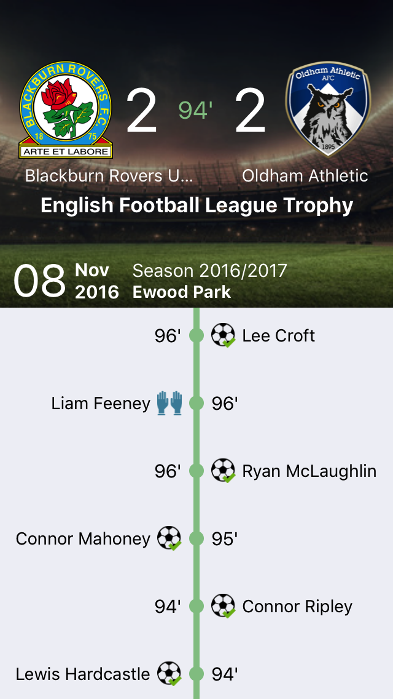
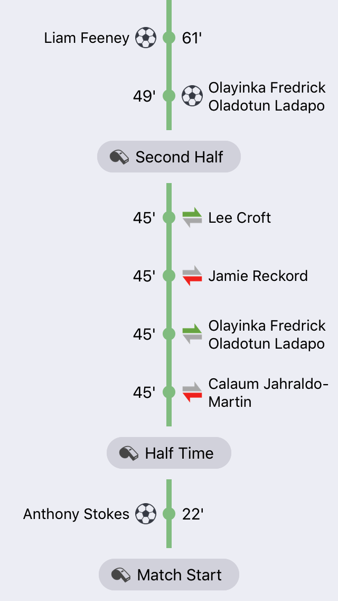
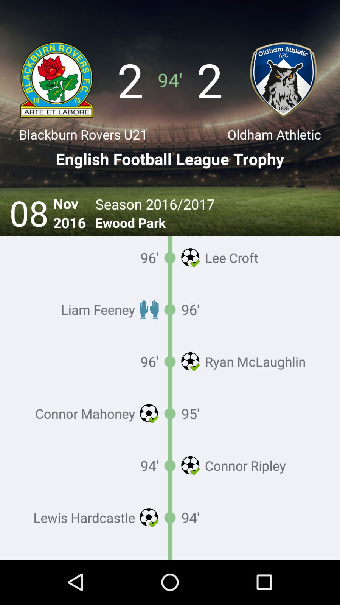
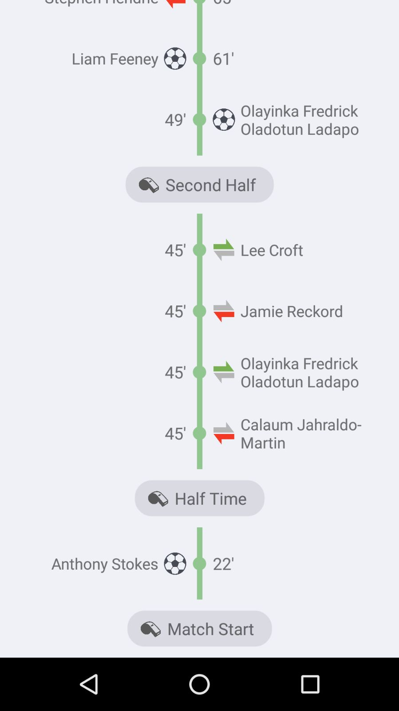

# Sportdec

The app provides live scores of a soccer match. The events of the match are displayed using a series of icons which represent each event, along with the timestamps when they happened.

## Installation and Usage

To build the app, follow these simple steps:

* Run cd /path/to/sportdec
* Run npm install inside the repository
* Run npm start
* Connect your device, or start an emulator
* Open another terminal instance, and run:
* react-native run-ios for starting the iOS version
* react-native run-android for starting the Android version

## Screenshots

### iOS

 

### Android

 

## Assumptions

* It is assumed that the data should be received via an API call. Because of this I have created a service to get this data. As we do not have this service available for this test I am returning the data from the .json provided with some delay to simulate a network call, thus when the service is available we just need to change the method implementation. For the record, both service and .json are in the same folder `/app/api`.

* `assets/football-event-icons-sprite/selection.json` could not be used in the app because some svg were ruined and the file `assets/football-events-sprite.png` could not be used due of the quality of the image, therefore I decided to pick new icons in the internet very similar to the icons provided.

* Team shields have not been provided, so they have been added manually in the .json

* No sample event for second yellow card or red card have been provide, therefore I assumed that event will have category as as `booking`, and value as `Red` and `SecondYellow` respectively.

* No sample event for own goal has been provided, therefore I assumed that event will have category as `goal`, and value as `OwnGoal`.

* Substitution on/off have separate events, but only one icon provided. As I have needed to find new icons I took advantage and picked another one. Therefore substitution are being represented using two icons.
